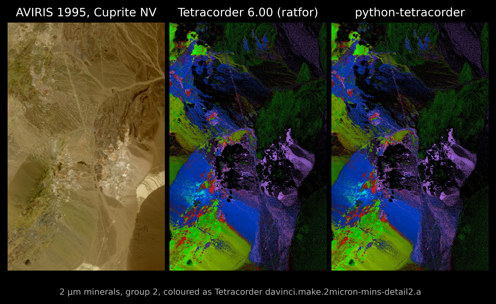

# python-tetracorder


*Cuprite95 group 2 (2 µm minerals). Native Tetracorder 6.00 (centre) and python-tetracorder (right) from the same inputs, both drawn with Tetracorder's own colouring. See [Fidelity](#fidelity).*

A port of the rules and evaluation logic of the tetracorder algorithm to pure Python - with no guarantee or warranty!  
This is merely a translation of the expertise encoded in the phenomenal [Tetracorder](https://github.com/PSI-edu/spectroscopy-tetracorder) expert system.  
All citation and credit should go to:  
[Roger N. Clark, Gregg A. Swayze, K. Eric Livo, Raymond F. Kokaly, Steve J. Sutley, J. Brad Dalton, Robert R. McDougal and Carol A. Gent, 2003, *Imaging spectroscopy: Earth and planetary remote sensing with the USGS Tetracorder and expert systems*, Journal of Geophysical Research, Vol 108.](https://github.com/PSI-edu/spectroscopy-tetracorder/blob/main/documentation/clark.et.al.2003.tetracorder.JGR.2002JE001847.pdf)

*This project is an independent Python reimplementation of parts of the Tetracorder spectral identification system. The original Tetracorder and spectroscopy software was written by Roger N. Clark and colleagues and is Copyright © 1975-2022 Roger N. Clark, Planetary Science Institute (PSI), and contributors named in the original code. The original software is distributed under the GNU General Public License and requires redistributions to retain its copyright notice, conditions and disclaimer; recodings into other languages must also make the translation and source code freely available. This project is not endorsed by Roger N. Clark, PSI, or the original contributors. The original Tetracorder software and licensing terms are available from the PSI [`spectroscopy-tetracorder`](https://github.com/PSI-edu/spectroscopy-tetracorder) repository.*


## Goals

The project is intended to:

- port Tetracorder mineral identification rules into a structured, machine-readable form;
- reproduce the relevant spectral evaluation logic in pure Python;
- make the rule evaluation process easier to inspect, test, modify, and integrate into other Python workflows;
- provide a foundation for testing Tetracorder-style mineral identification against modern hyperspectral datasets;
- The implementation is therefore intended to rely primarily on standard Python scientific tools such as:
  - NumPy
  - SciPy
  - SQLite

## Rules/Materials

The project is based on published/released [Tetracorder](https://github.com/PSI-edu/spectroscopy-tetracorder) rule definitions and attempts to reproduce their evaluation behaviour independently in Python.
The most recent expert sytem ruleset is [cmd.lib.setup.t6.00a6](https://github.com/PSI-edu/spectroscopy-tetracorder/blob/main/tetracorder.cmds/tetracorder6.00a.cmds/cmd.lib.setup.t6.00a6). These rules have been parsed into json format, with some manual editing resulting in a [dataset](resources/tetracorder_rules_as_dict.json) that can be read by the python implementation  

## Reference spectra

Tetracorder rules reference spectra from USGS spectral libraries. The most recent version of the USGS spectral library is available [here](https://www.usgs.gov/data/usgs-spectral-library-version-7-data). However, the Tetracorder rules refer to specific reference spectra from a previous version of this library, and mapping between them is not straightforward.
The SQLite reference spectra database in this repository is derived from the libraries in the [Tetracorder repo](https://github.com/PSI-edu/spectroscopy-tetracorder). The database here is derived from the native libraries rather than the convolved variants.

## Fidelity

### Tetracorder 6.00 Cuprite95 validation test

#### Native Tetracorder run

The reference run for this test was perfomed in a [tetracorder-lite](https://github.com/emit-sds/tetracorder-lite) docker container. Tetracorder-lite vendors the entire [authoritative Tetracorder and Specpr](https://github.com/PSI-edu/spectroscopy-tetracorder) ratfor build, with marginal difference to the original cmd files (a renamed material, and some different comments).

The native run consumes the [Cuprite95 AVIRIS](https://popo.jpl.nasa.gov/1995_cuprite_RTGC_rfl_cube/) cube using the Tetracorder 6.00 command/rule configuration and writes separate output products for the enabled material groups and cases. The setup, physical conditions, disabled groups etc are all faithrully reproduced from the [testrun](https://github.com/PSI-edu/spectroscopy-tetracorder/tree/main/cuprite95) in the original Tetracorder, except this run used expert system 6.0 and the hosted run results use 5.26e1.

Native Tetracoder internals:

- the Cuprite95 input image cube;
- the DN offset, scale factor and deleted-data value recorded in the native run history;
- the AVIRIS95 wavelength record from the native `s06av95a` SPECpr library;
- the native `[DELETPTS]` channel mask;
- the native temperature and pressure settings;
- any groups or cases explicitly disabled by the native run;
- the native SPECpr-convolved `s06av95a` / `r06av95a` reference spectra;
- the native group and case output images used for comparison.

are all recorded.


#### Python run

##### Cube preparation

The python side test run perfomed the same cube preparation as the Tetracorder internals.
 - converts the native integer DN values to float32 and applies exactly the native Tetracorder scaling  
 ```cube = (dn.astype(np.float32) + np.float32(offset)) * np.float32(scale)```  
 - Pixels whose raw DN equals the native deleted-data sentinel are replaced by NaN  
```cube[dn == deleted_dn] = np.nan```
 - The resulting cube is cached as a .npy, then loaded and made contiguous  
 ```cube = np.ascontiguousarray(full_cube[LINES])```
  - reads the native AVIRIS95 wavelength vector from [s06av95a](https://github.com/PSI-edu/spectroscopy-tetracorder/blob/main/sl1/usgs/library06.conv/s06av95a) record 6 and recreates the native [DELETPTS] mask.

This ensures that `python-tetracorder` is supplied with the same cube, wavelengths, valid-band mask, physical conditions and rules used by the native run.

##### Library
`python-tetracorder` has an internal GaussianConvolver and SQLite database of the required reference spectra, at their original library sampling, before any convolution. This convolver is perhaps not as robust as it could be, and certainly differs from the SpecPr convolution used to produce their sensor-specific convolution libraries.  

As this is an algorithmic test only, it was decided to use the existing pre-convolved libraries, [s06av95a](https://github.com/PSI-edu/spectroscopy-tetracorder/blob/main/sl1/usgs/library06.conv/s06av95a) / [r06av95a](https://github.com/PSI-edu/spectroscopy-tetracorder/blob/main/sl1/usgs/rlib06/r06av95a), for the python side test run.

Instead of loading the spectral reference database and performing convolution in Python, the validation test supplies the already-convolved native SPECpr reference spectra directly to `MaterialEvaluator`.  Thus the subclassing of GroupEvaluator in the validation script, to avoid the convolution step.  

No evaluation functions in `python-tetracorder` are patched or replaced.

Everything downstream of reference preparation is executed by the Python package, including:

- continuum and feature evaluation;
- fit and band-depth calculation;
- feature weighting;
- material constraints;
- diagnostic / required feature tests;
- NOT tests;
- group-0 handling;
- group winner selection;
- case triggering and case evaluation;
- NVRES / red-edge evaluation;
- physical-condition material disabling.

All enabled groups and cases are evaluated. Group-0 materials are included in groups where the native configuration includes group 0.

### Comparison

The full python run and comparison script is available [here](tests/test_package_native_inputs_native_refs.py)

The Python and native Tetracorder outputs use different internal representations, so the Python results are first translated into the native Tetracorder output format before comparison.

On the python side, for each group or case, python-tetracorder returns a resolved result containing spatial arrays:  

 - *winner* - the material identifier selected at each pixel;
 - *fit* - the floating-point fit value of the winning material;
 - *depth* - the floating-point band-depth value;
 - *fit_depth* - the combined fit-depth value.

These are retained as NumPy arrays at Python numerical precision. Unlike native Tetracorder, Python does not create a separate output image for every material during evaluation.

Native Tetracorder writes separate 8-bit products for each material, including:

<material>.fit.gz
<material>.depth.gz
<material>.fd.gz

To make the Python result directly comparable, the validation script recreates these products in memory for each material.

For a given material, the Python winner map is first used to retain values only where that material won:

mine = winner == material

All other pixels are set to zero.

The floating-point Python values are then converted to the same unsigned 8-bit representation used by native Tetracorder.

Fit values use:

DN = nint(fit x 255)

while depth and fit-depth use the material-specific native depth scale recorded by the Tetracorder run.

The conversion reproduces native output behaviour by:  
 - applying the native scale;
 - converting non-finite values to zero;
 - rounding using the native nearest-integer convention;
 - clipping values to the range 0 - 255;
 - storing the result as uint8.

The resulting Python arrays therefore represent the values that python-tetracorder would have written had it used the native Tetracorder byte-output convention.

The corresponding native .fit.gz, .depth.gz, and .fd.gz files are decompressed and read directly as uint8 images.

The native values are not rescaled back to floating point. Instead, the translated Python outputs are compared directly against the byte values written by Tetracorder.

The comparison therefore evaluates both implementations in the same output space; comparing native uint8 output directly.

Classification agreement is measured from pixels where the fit image is non-zero, while fit and depth agreement is assessed directly from the corresponding 8-bit values.

### Results  

The python implementation is significantly slower - although there are optimisation that can be performed once behaviour is equivalent.

Summary statistics are also calculated for each group and case. Materials present in the rules but without a corresponding native output file are reported as `without native output` and are excluded from the direct numerical comparison.

The complete test comparison output is in [this file](tests/fidelity_test_specpr_preconvolved). Only a summary is presented here.

#### Run summary

| Item | Value |
|---|---:|
| Package run | 1053 s |
| Materials disabled | 26 |


#### Summary

| Set | Materials | No native output | Native pixels | Python pixels | Jaccard | Fit exact |
|---|---:|---:|---:|---:|---:|---:|
| Group 1 | 140 | 20 | 573,079 | 573,079 | 1.0000 | 1.0000 |
| Group 2 | 227 | 21 | 596,794 | 596,794 | 1.0000 | 1.0000 |
| Group 3 | 4 | 0 | 550,506 | 550,506 | 1.0000 | 1.0000 |
| Group 4 | 48 | 21 | 401,157 | 401,157 | 1.0000 | 0.9999 |
| Group 5 | 35 | 20 | 7,265 | 7,265 | 1.0000 | 1.0000 |
| Group 20 | 41 | 20 | 17,727 | 17,727 | 1.0000 | 0.9986 |
| Group 21 | 40 | 20 | 17,726 | 17,726 | 1.0000 | 0.9986 |
| Group 22 | 29 | 20 | 6,178 | 6,178 | 1.0000 | 1.0000 |
| Group 37 | 29 | 20 | 6,178 | 6,178 | 1.0000 | 1.0000 |
| Group 38 | 29 | 20 | 107,050 | 107,050 | 1.0000 | 1.0000 |
| Case 1 | 2 | 0 | 528,969 | 528,969 | 1.0000 | 0.9999 |
| Case 2 | 15 | 0 | 466,554 | 466,554 | 1.0000 | 1.0000 |
| Case 3 | 1 | 0 | 432,034 | 432,034 | 1.0000 | 1.0000 |
| Case 4 | 1 | 0 | 460,509 | 460,509 | 1.0000 | 1.0000 |
| Case 5 | 1 | 0 | 514,984 | 514,984 | 1.0000 | 1.0000 |
| Case 6 | 13 | 0 | 45,759 | 45,759 | 1.0000 | 1.0000 |
  

The Python implementation reproduced the native Tetracorder classifications very close to exactly. Across approximately 4.73 million classified group/case assignments, only three pixel-level winner differences are apparent from the reported material counts, equivalent to about 0.00006% of classifications. All reported group and case Jaccard scores round to 1.0000. Numerical fit outputs are also almost entirely identical after conversion to Tetracorder's native 8-bit format, with the lowest exact-fit agreement being 99.86%. The remaining differences therefore appear to be numerical precision effects rather than substantive differences in the classification algorithm.  

At this stage, focus will move to optimisation of the code performance.

### Scope of the validation

This test validates the Tetracorder numerical evaluation and decision pipeline downstream of reference-spectrum preparation against the native Tetracorder 6.00 Cuprite95 run.

It deliberately does not test whether the Python reference-library convolution reproduces SPECpr convolution. Reference-spectrum preparation is therefore a separate validation step.

The purpose of this test is to determine whether, given the same target spectra, wavelength configuration, rules and convolved reference spectra, `python-tetracorder` reproduces the material classifications and numerical outputs of native Tetracorder 6.00.

## Next steps

 - performance optimisation;  
   - refactoring  
   - numba jit where possible  
   - caching  
 - convolution  
   - the existing convolver needs re-writing, perhaps incorporating the [tetrapy](https://github.com/emit-sds/tetracorder-lite/tree/main/tetrapy) convolver instead.


## Scope

This repository is **not** currently intended to be:

- a drop-in replacement for the complete Tetracorder software package;
- a reproduction of its graphical tools;
- a validated operational mineral-mapping product;
- an authoritative implementation of every historical Tetracorder behaviour;
- a substitute for expert spectral interpretation.

It is an independent Python reimplementation of the parts of the algorithm required to understand, test, and reproduce the published rule-based spectral evaluation workflow.

## Disclaimer

This software is provided for research and development purposes.

There is **no guarantee or warranty** that the implementation is:  
- scientifically equivalent to the original Tetracorder implementation, 
- complete, 
- correct,
- or suitable for any particular application.
  
Do not use results from this repository as the sole basis for scientific, commercial, exploration, environmental, safety, or other consequential decisions.

