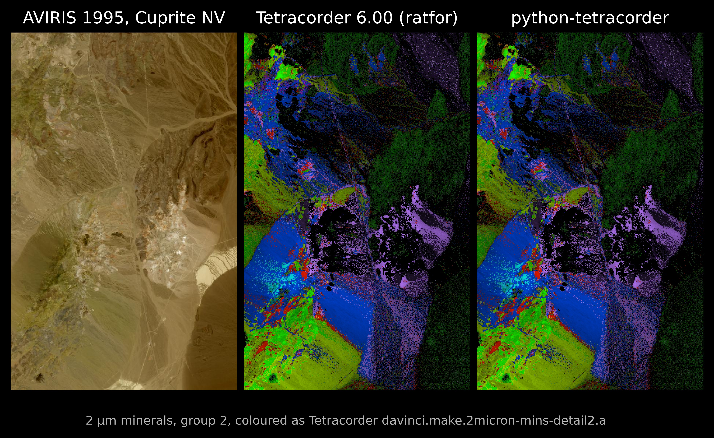

# python-tetracorder


*Cuprite95 group 2 (2 µm minerals). Native Tetracorder 6.00 (centre) and python-tetracorder (right) from the same inputs, both drawn with Tetracorder's own colouring. See [Fidelity](#fidelity).*

A port of the rules and evaluation logic of the tetracorder algorithm to pure Python - with no guarantee or warranty!  
This is merely a translation of the expertise encoded in the phenomenal [Tetracorder](https://github.com/PSI-edu/spectroscopy-tetracorder) expert system.  
All citation and credit should go to:  
[Roger N. Clark, Gregg A. Swayze, K. Eric Livo, Raymond F. Kokaly, Steve J. Sutley, J. Brad Dalton, Robert R. McDougal and Carol A. Gent, 2003, *Imaging spectroscopy: Earth and planetary remote sensing with the USGS Tetracorder and expert systems*, Journal of Geophysical Research, Vol 108.](https://github.com/PSI-edu/spectroscopy-tetracorder/blob/main/documentation/clark.et.al.2003.tetracorder.JGR.2002JE001847.pdf)

*This project is an independent Python reimplementation of parts of the Tetracorder spectral identification system. The original Tetracorder and spectroscopy software was written by Roger N. Clark and colleagues and is Copyright © 1975-2022 Roger N. Clark, Planetary Science Institute (PSI), and contributors named in the original code. The original software is distributed under the GNU General Public License and requires redistributions to retain its copyright notice, conditions and disclaimer; recodings into other languages must also make the translation and source code freely available. This project is not endorsed by Roger N. Clark, PSI, or the original contributors. The original Tetracorder software and licensing terms are available from the PSI [`spectroscopy-tetracorder`](https://github.com/PSI-edu/spectroscopy-tetracorder) repository.*


## Goals

The project is intended to:

- port Tetracorder mineral identification rules into a structured, machine-readable form;
- reproduce the relevant spectral evaluation logic in pure Python;
- make the rule evaluation process easier to inspect, test, modify, and integrate into other Python workflows;
- provide a foundation for testing Tetracorder-style mineral identification against modern hyperspectral datasets;
- The implementation is therefore intended to rely primarily on standard Python scientific tools such as:
  - NumPy
  - SciPy
  - SQLite
  - Numba (for a small number of performance-critical inner loops)

## Rules/Materials

The project is based on published/released [Tetracorder](https://github.com/PSI-edu/spectroscopy-tetracorder) rule definitions and attempts to reproduce their evaluation behaviour independently in Python.
The most recent expert system ruleset is [cmd.lib.setup.t6.00a6](https://github.com/PSI-edu/spectroscopy-tetracorder/blob/main/tetracorder.cmds/tetracorder6.00a.cmds/cmd.lib.setup.t6.00a6). These rules have been parsed into json format, with some manual editing resulting in a [dataset](resources/tetracorder_rules_as_dict.json) that can be read by the python implementation  

## Reference spectra

Tetracorder rules reference spectra from USGS spectral libraries. The most recent version of the USGS spectral library is available [here](https://www.usgs.gov/data/usgs-spectral-library-version-7-data). However, the Tetracorder rules refer to specific reference spectra from a previous version of this library, and mapping between them is not straightforward.
The SQLite reference spectra database in this repository is derived from the libraries in the [Tetracorder repo](https://github.com/PSI-edu/spectroscopy-tetracorder). The database here is derived from the native libraries rather than the convolved variants.

## Usage

Install from a checkout:

```bash
pip install -e .
```

This installs the `tetracorderp` package. There is no re-exported top-level
API yet, so import directly from the submodule you need. The entry point is
`GroupEvaluator`: constructing it runs the full rule evaluation over your
cube, and the writer methods emit results in various formats.

```python
from tetracorderp.group_evaluator import GroupEvaluator

# cube: (lines, samples, bands) reflectance array, float
# wavelengths, fwhm: 1D arrays, one entry per band
run = GroupEvaluator(
    target_spectra=cube,
    target_wavelengths=wavelengths,
    target_fwhm=fwhm,
    mode="default",                 # see tetracorderp.config.VARIABLE_PRESETS
    target_valid_bands=valid_bands, # optional bool mask, defaults to all-True
)
# Evaluation runs inside __init__; run.group_winners / run.case_winners
# are already populated by the time the constructor returns.

run.write_like_tetracorder("output_dir")  # native-style .fit.gz/.depth.gz/.fd.gz
run.write_npz("results.npz")              # single compressed npz
run.write_jpgs("jpgs_dir")                # classification map images
```

`reference_file` and `rules_file` default to the bundled
`resources/tetracorder_rules_references.db` and
`resources/tetracorder_rules_as_dict.json` if not supplied explicitly.

## Fidelity

### Tetracorder 6.00 Cuprite95 validation tests

#### Native Tetracorder run

The reference run for these tests was performed in a [tetracorder-lite](https://github.com/emit-sds/tetracorder-lite) docker container. Tetracorder-lite vendors the entire [authoritative Tetracorder and Specpr](https://github.com/PSI-edu/spectroscopy-tetracorder) ratfor build, with marginal difference to the original cmd files (a renamed material, and some different comments).

The native run consumes the [Cuprite95 AVIRIS](https://popo.jpl.nasa.gov/1995_cuprite_RTGC_rfl_cube/) cube using the Tetracorder 6.00 command/rule configuration and writes separate output products for the enabled material groups and cases. The setup, physical conditions, disabled groups etc are all faithfully reproduced from the [testrun](https://github.com/PSI-edu/spectroscopy-tetracorder/tree/main/cuprite95) in the original Tetracorder, except this run used expert system 6.0 and the hosted run results use 5.26e1.

Native Tetracorder internals:

- the Cuprite95 input image cube;
- the DN offset, scale factor and deleted-data value recorded in the native run history;
- the AVIRIS95 wavelength record from the native `s06av95a` SPECpr library;
- the native `[DELETPTS]` channel mask;
- the native temperature and pressure settings;
- any groups or cases explicitly disabled by the native run;
- the native SPECpr-convolved `s06av95a` / `r06av95a` reference spectra;
- the native group and case output images used for comparison.

are all recorded.


#### Python runs

##### Cube preparation

The python side test runs were perfomed on the same cube, using the same preparation as the Tetracorder internals.
 - converts the native integer DN values to float32 and applies exactly the native Tetracorder scaling  
 ```cube = (dn.astype(np.float32) + np.float32(offset)) * np.float32(scale)```  
 - Pixels whose raw DN equals the native deleted-data sentinel are replaced by NaN  
```cube[dn == deleted_dn] = np.nan```
 - The resulting cube is cached as a .npy, then loaded and made contiguous  
 ```cube = np.ascontiguousarray(full_cube[LINES])```
  - reads the native AVIRIS95 wavelength vector from [s06av95a](https://github.com/PSI-edu/spectroscopy-tetracorder/blob/main/sl1/usgs/library06.conv/s06av95a) record 6 and recreates the native [DELETPTS] mask.

This ensures that `python-tetracorder` is supplied with the same cube, wavelengths, valid-band mask, physical conditions and rules used by the native run.

##### Library

The first test to establish algorithmic fidelity was ran by passing in the native convolved reference spectra. It is documented [here](tests/fidelity_test_specpr_preconvolved.md)  

The second test used a vendored convolve function from [tetracorder-lite](https://github.com/emit-sds/tetracorder-lite) on the SQLite database derived from the Tetracorder repository.  

As the vendored convolver requires fwhm data per reference, the database was updated to include that information in the samples table. The python code has also been adjusted to handle the new database format.

The second test established the fidelity of the vendored convolver and internal SQLite library. The results of that test are documented [here](tests/fidelity_test_full_python.md)   

All further tests of the codebase will use the test script documented [here](tests/Full_python_test_run_script.py)


### Comparison

Native Tetracorder writes separate 8-bit products for each material, including:

 - `<material>.fit.gz`
 - `<material>.depth.gz`
 - `<material>.fd.gz`

The `write_like_tetracorder()` method on `GroupEvaluator` emulates this output style.
The comparison therefore evaluates both implementations in the same output space; comparing native uint8 output directly.

Classification agreement is measured from pixels where the fit image is non-zero, while fit and depth agreement is assessed directly from the corresponding 8-bit values.

### Results  

The python implementation is slower than native. The full Cuprite95 run (972 × 614 pixels, all enabled groups and
cases) currently takes **466 s**, down from 900+ s before the first optimisation pass - see
[Recent changes](#recent-changes). Every optimisation step is checked against this same fidelity test before it is merged.

Summary statistics are also calculated for each group and case. 

The complete test comparison output is in [this file](tests/fidelity_test_full_python.md). Only a summary is presented here.

| Group | Materials | Native only | Python only | Native pixels | Python pixels | Jaccard | Fit exact |
|---|---:|---:|---:|---:|---:|---:|---:|
| case.ep-cal-chl | 13 | 0 | 0 | 45,759 | 45,759 | 1.0000 | 1.0000 |
| case.red-edge | 2 | 0 | 0 | 528,969 | 528,969 | 1.0000 | 0.9996 |
| case.veg.type | 15 | 0 | 0 | 466,554 | 466,554 | 1.0000 | 1.0000 |
| group.1.5um-broad | 48 | 0 | 1 | 401,157 | 401,157 | 1.0000 | 1.0000 |
| group.1um | 140 | 0 | 0 | 573,079 | 573,079 | 1.0000 | 0.9999 |
| group.2um | 227 | 0 | 1 | 596,794 | 596,794 | 1.0000 | 1.0000 |
| group.2um-broad | 35 | 0 | 0 | 7,265 | 7,265 | 1.0000 | 1.0000 |
| group.ch4gas-2.3um | 29 | 0 | 0 | 6,178 | 6,178 | 1.0000 | 1.0000 |
| group.co2gas-2um | 29 | 0 | 0 | 107,050 | 107,050 | 1.0000 | 0.9997 |
| group.ree | 41 | 0 | 0 | 17,727 | 17,727 | 1.0000 | 0.9987 |
| group.ree_g21 | 40 | 0 | 0 | 17,726 | 17,726 | 1.0000 | 0.9987 |
| group.ree_samar | 29 | 0 | 0 | 6,178 | 6,178 | 1.0000 | 1.0000 |
| group.veg | 7 | 0 | 0 | 1,958,033 | 1,958,033 | 1.0000 | 0.9999 |

While there is minor degradation from the algorithmic fidelity test, incorporating the SQLite database and the tetrapy convolver, has had no impact on the material classification per pixel. The difference in fit exact (and depth exact) are attributed to floating point rounding, order of accumulation variations in the codebase, and exacerbated by the uint8 quantisation.  

Native disables materials at setup and creates no output files for them (creatoutfiles.r:76), listing them in AAA.info/disabled-materials.txt. python-tetracorder reaches the same state during evaluation: a feature whose windows have no usable channels returns invalid, takes zero weight, and rejects the material if it is weak or must-have. Two materials - wollastonite_hs348.3b and potassium_nitrate - therefore appear as empty python outputs with no native counterpart. 

The summary above is unchanged by the optimisation work described in [Recent changes](#recent-changes): each step
reproduced this table exactly.


## Next steps

Performance, with the aim of bringing the full Cuprite95 run under 180 s without changing the fidelity results:

- **Blocking**: evaluate the cube in blocks of pixels so per-feature temporaries stay in cache, and store group/case
  winners as integer codes instead of object arrays.
- **Precomputation**: resolve everything that depends only on the rules, references and wavelength grid once per run
  (channel ranges, reference continua, band extrema, feature weights) instead of on every call.
- **Fused Numba kernel for linear features**: continuum removal and the bandmp least-squares sums in a single pass per
  pixel, so no pixels x channels arrays are built; then `prange` over pixels.

## Recent changes

### Performance pass 1 - 900+ s to 466 s

Timings are for the full Cuprite95 fidelity run on the same machine. Each step reproduced the fidelity summary table
exactly.

| Step | Run time |
|---|---:|
| Before this pass | 900+ s |
| Caching and clean-up (@kevinhaoaus) | 781 s |
| Numba kernel for `_window_mean` | 723 s |
| `numpy.ma` removed from the evaluation path | 466 s |
| Evaluating the full cube in blocks | 382 s |

**Caching, packaging and clean-up** - contributed by [@kevinhaoaus](https://github.com/kevinhaoaus) in
his [fork](https://github.com/kevinhaoaus/python-tetracorder). Thanks Kevin!

- **Packaging fix**: `pyproject.toml` declared `packages = ["TetracorderP"]`, which didn't match the lowercase
  `tetracorderp/` package directory. That goes unnoticed on case-insensitive filesystems such as Windows, but the
  install fails on Linux and macOS. Also added the previously undeclared `matplotlib` dependency (used by
  `GroupEvaluator.write_jpgs` / `write_plain_jpgs`).
- **Bug fixes**: removed two leftover debug `print()` calls in `material_evaluation.py`, and fixed a broken
  `from src.config import ...` in `tests/test_package_native_inputs_native_refs.py`.
- **Caching** (no numerical change):
  - `MaterialEvaluator.__init__` called `_prepare_rules()` twice; the duplicate call is removed.
  - `_native_not_source()` is memoized per `(target_spectra, source_rule_id, source_feature_id)`, so materials that
    veto against the same source material no longer re-evaluate it.
  - `_wtochbin()`, a pure window-to-channel lookup, is memoized by `(wavelengths, w1, w2)`.
- He also re-benchmarked the vectorised `_window_mean` that was already commented out in `tetracorder_ops.py`, and
  confirmed it is slower than the channel-by-channel loop for realistic window sizes.
- **Docs**: added the [Usage](#usage) section.

**Numba kernel for `_window_mean`**

- The continuum window means are now computed by a small `@njit` kernel that sums each pixel's channels in channel
  order in REAL*4, as the Fortran DO loop does, so results are bit-identical to the previous loop.
  `error_model="numpy"` keeps an empty window giving NaN (deleted) rather than raising `ZeroDivisionError`.
- The gain was small (about 7%): the old loop was already vectorised across pixels, so most of the time was in the
  full-size temporary arrays around it rather than the loop itself.

**`numpy.ma` removed from the evaluation path**

Masked arrays allocate a data array and a mask array for every operation, and their round trips (`masked_invalid`,
`filled`, `masked_where`) copied the full pixels x channels arrays several times per feature.

- A deleted pixel is now represented by `NaN` throughout `tetracorder_ops.py` and `material_evaluation.py`, and
  `np.ma.filled(x, 0.0)` is replaced by an explicit NaN-to-zero step at the same points. Unmasked values were always
  finite (the tp1mat fit and continuum checks require it), so NaN marks exactly the pixels the mask did.
- The nvres continuum-window means reproduce `MaskedArray.mean`'s arithmetic exactly (float32 sum, then float64
  division by the count), so the red-edge case is unchanged.
- Removed six continuum-shape and band-bottom calculations from `characterise_feature` whose results were never
  read; `resolve_feature_tests` recomputes these from the current depth.
- One behavioural note: for a `relative` NOT whose relative-to feature has been deleted at a pixel, the denominator now
  takes the 1e-13 floor, matching native tp1mat (which zeroes a deleted feature). Previously it used a stale
  pre-deletion depth. This changed no pixels on Cuprite95.


**Cube evaluated in blocks**

`GroupEvaluator` now evaluates the cube in strips of whole lines (`blocking=True` by default, 64 lines per strip) and
stitches the results back together along the line axis.

- Every step of the pipeline is per pixel, so each strip gives exactly that strip's final answers and the stitched
  result is identical to a whole-cube evaluation. `evaluate()` now takes the spectra as an argument and is run once
  per strip; `blocking=False` evaluates the whole cube in one call.
- Groups appear in every strip. A case only appears in strips where some pixel's group winner triggered it, so
  strips without it are filled with nothing detected when the results are stitched.
- The gain (466 s to 382 s, about 18%) comes from memory behaviour, not arithmetic: the per-feature pixels x channels
  temporaries and the per-material results held until group resolution are strip-sized, small enough to stay in CPU
  cache, instead of cube-sized. Strips are views of the cube, so no full-size copy is made when it is C-contiguous.
- Each strip repeats the static per-feature work (window checks, reference continuum, feature weights), which offsets
  part of the gain; precomputing that once per run is the next step.

The NOT-source cache was reworked to be safe with more than one set of spectra:

- It was keyed on `id(target_spectra)`, and Python reuses the ids of freed arrays, so a later strip could silently
  receive an earlier strip's NOT results.
- `MaterialEvaluator.evaluate()` now takes `same_target=False` by default and clears the cache first, so direct calls
  are always safe. `GroupEvaluator` passes `same_target=True` within a strip and calls `cache_clear()` between strips.
  The key is now just `(source_rule_id, source_feature_id)`.


The full fidelity report for this pass is in [tests/fidelity_test_blocking.md](tests/fidelity_test_blocking.md).

## Scope

This repository is **not** currently intended to be:

- a drop-in replacement for the complete Tetracorder software package;
- a reproduction of its graphical tools;
- a validated operational mineral-mapping product;
- an authoritative implementation of every historical Tetracorder behaviour;
- a substitute for expert spectral interpretation.

It is an independent Python reimplementation of the parts of the algorithm required to understand, test, and reproduce the published rule-based spectral evaluation workflow.

## Disclaimer

This software is provided for research and development purposes.

There is **no guarantee or warranty** that the implementation is:  
- scientifically equivalent to the original Tetracorder implementation, 
- complete, 
- correct,
- or suitable for any particular application.
  
Do not use results from this repository as the sole basis for scientific, commercial, exploration, environmental, safety, or other consequential decisions.

## License

python-tetracorder is licensed under the GNU General Public License, version 3;
see [LICENSE](LICENSE).

Third-party components keep their own licenses (details in [NOTICE](NOTICE)):

| Component | Where | License |
|---|---|---|
| Spectral convolution, from [tetracorder-lite](https://github.com/emit-sds/tetracorder-lite) | `tetracorderp/conv/convolve.py` | Apache-2.0 (Caltech/JPL), modified |
| Tetracorder command files and algorithm, from [spectroscopy-tetracorder](https://github.com/PSI-edu/spectroscopy-tetracorder) | rule source, `resources/` | GPL-3.0 + PSI conditions |
| USGS splib06 / sprlb06 reference spectra | `resources/` | as distributed with Tetracorder |